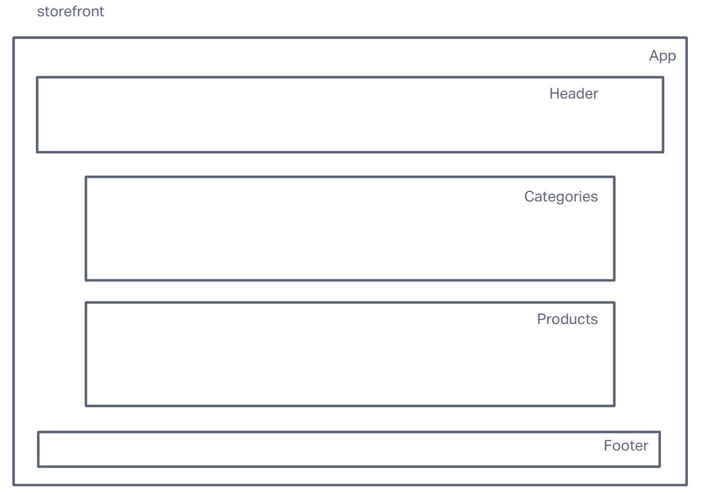
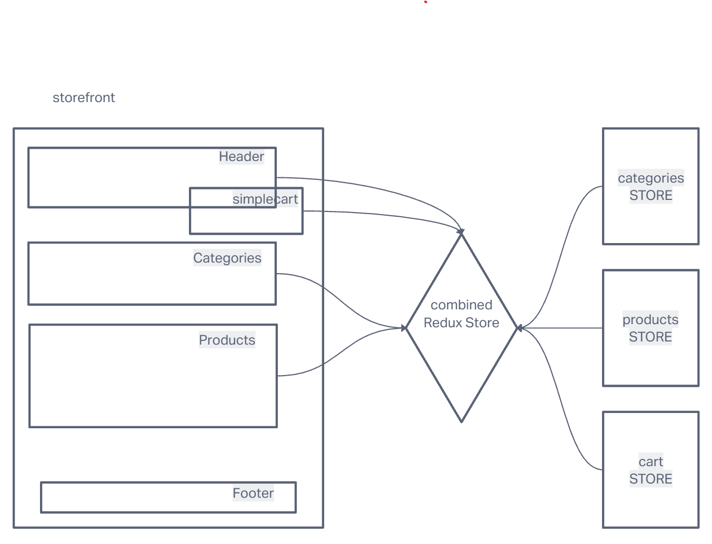

# LAB - Class 36, 37, 38

## Project: Storefront

### Author: Steve Gant

### Problem Domain  

*Phase One -  Application State with Redux*
- Functionality
  - As a user, I expect to see a list of available product categories in the store so that I can easily browse products.
  - As a user, I want to choose a category and see a list of all available products matching that category.
  - As a user, I want a clean, easy to use user interface so that I can shop the online store with confidence

*Phase Two - Combined Reducers*
  - As a user, I want to choose from products in the list and add them to my shopping cart.
  - As a user, I want to see the products that I’ve added to my shopping cart in a growing list on the side of the page”.
  - As a user, I want to change the quantity of items I intend to purchase in the header. i.e. CART (1)
  - As a user, I want to be able to remove an item from my shopping cart.

*Phase Three - Redux - Asynchronous Actions*
- In phase 3, we will be connecting our Virtual Store to a live API so that our data is persistent and able to be separately managed.

  - As a user, I want to interact with live inventory so that I have confidence that the displayed products are in stock.
  - As a user, I want to know to that when I add an item to my cart, that it is removed from inventory so that no other users can purchase it.

### Links and Resources

- [GitHub Branch](https://github.com/stevengant/storefront/tree/lab36) 

- [CodeSandbox - branch Lab36](https://codesandbox.io/p/github/stevengant/storefront/lab36?file=README.md&workspace=%257B%2522activeFilepath%2522%253Anull%252C%2522openFiles%2522%253A%255B%255D%252C%2522sidebarPanel%2522%253A%2522EXPLORER%2522%252C%2522gitSidebarPanel%2522%253A%2522COMMIT%2522%252C%2522spaces%2522%253A%257B%2522clg1qv43a00eu356lzjm6iur3%2522%253A%257B%2522key%2522%253A%2522clg1qv43a00eu356lzjm6iur3%2522%252C%2522name%2522%253A%2522Default%2522%252C%2522devtools%2522%253A%255B%257B%2522type%2522%253A%2522PREVIEW%2522%252C%2522taskId%2522%253A%2522start%2522%252C%2522port%2522%253A3000%252C%2522key%2522%253A%2522clg1qv43a00ev356la3ghu2ky%2522%252C%2522isMinimized%2522%253Afalse%257D%255D%257D%257D%252C%2522currentSpace%2522%253A%2522clg1qv43a00eu356lzjm6iur3%2522%252C%2522spacesOrder%2522%253A%255B%2522clg1qv43a00eu356lzjm6iur3%2522%255D%252C%2522hideCodeEditor%2522%253Afalse%257D)

- [Github PR - lab37](https://github.com/stevengant/storefront/pull/4)

- [CodeSandbox - branch Lab37](https://codesandbox.io/p/github/stevengant/storefront/combined-reducers?file=README.md&workspace=%257B%2522activeFilepath%2522%253Anull%252C%2522openFiles%2522%253A%255B%255D%252C%2522sidebarPanel%2522%253A%2522EXPLORER%2522%252C%2522gitSidebarPanel%2522%253A%2522COMMIT%2522%252C%2522spaces%2522%253A%257B%2522clg322viz00cq356l06p2evn9%2522%253A%257B%2522key%2522%253A%2522clg322viz00cq356l06p2evn9%2522%252C%2522name%2522%253A%2522Default%2522%252C%2522devtools%2522%253A%255B%257B%2522type%2522%253A%2522PREVIEW%2522%252C%2522taskId%2522%253A%2522start%2522%252C%2522port%2522%253A3000%252C%2522key%2522%253A%2522clg322viz00cr356lq8qr258j%2522%252C%2522isMinimized%2522%253Afalse%257D%255D%257D%257D%252C%2522currentSpace%2522%253A%2522clg322viz00cq356l06p2evn9%2522%252C%2522spacesOrder%2522%253A%255B%2522clg322viz00cq356l06p2evn9%2522%255D%252C%2522hideCodeEditor%2522%253Afalse%257D)

- [GitHub PR lab38](https://github.com/stevengant/storefront/pull/7)
- [CodeSandbox - branch redux-async-actions](https://codesandbox.io/p/github/stevengant/storefront/redux-async-actions?file=README.md&workspace=%257B%2522activeFilepath%2522%253A%2522README.md%2522%252C%2522openFiles%2522%253A%255B%2522README.md%2522%255D%252C%2522sidebarPanel%2522%253A%2522EXPLORER%2522%252C%2522gitSidebarPanel%2522%253A%2522COMMIT%2522%252C%2522spaces%2522%253A%257B%2522clg4gwwzy006m356myfw26jdz%2522%253A%257B%2522key%2522%253A%2522clg4gwwzy006m356myfw26jdz%2522%252C%2522name%2522%253A%2522Default%2522%252C%2522devtools%2522%253A%255B%257B%2522key%2522%253A%2522clg4gwwzz006n356m1fyjzpny%2522%252C%2522type%2522%253A%2522PROJECT_SETUP%2522%252C%2522isMinimized%2522%253Afalse%257D%255D%257D%257D%252C%2522currentSpace%2522%253A%2522clg4gwwzy006m356myfw26jdz%2522%252C%2522spacesOrder%2522%253A%255B%2522clg4gwwzy006m356myfw26jdz%2522%255D%252C%2522hideCodeEditor%2522%253Afalse%257D)

### Setup

- `npm install`

#### How to initialize/run your application (where applicable)

- `npm start`

#### How to use your library (where applicable)

#### Features / Routes

- Display a list of our product categories
- Display a listing of products for each category, when the category is selected
- From the product listings:
  - Click to view a full detail page about the product

#### Tests

categories.test.js
  - Initializes initialState
  - Selects category and updates activgeCategory
  - Filters products by category

#### UML

